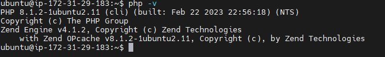

# INSTALLING PHP
Installation of PHP

To install these 3 packages at once, run:
```
sudo apt install php libapache2-mod-php php-mysql
```

Once the installation is finished, you can run the following command to confirm your PHP version:

```
php -v
```


At this point, your LAMP stack is completely installed and fully operational.

- Linux (Ubuntu)
- Apache HTTP Server
- MySQL
- PHP